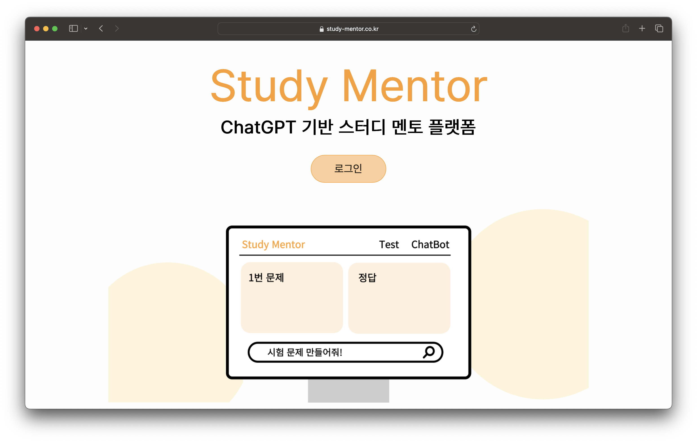

# Study-mentor: 생성형 AI기반 스터디 멘토 서비스

-   2024년 1학기 컴퓨터공학부 졸업설계 프로젝트 최우수작품
-   디지털 혁신 페스타 2024 참가 작품




## Tech Stack


## Installation

1. Clone the repository

```bash
git clone https://github.com/your-username/study-mentor.git
```

2. Navigate to the project directory

```bash
cd study-mentor
```

3. Install dependencies using npm

```bash
npm install
```

4. Run

```bash
npm run dev
```

## 👨🏻‍💻 Member

| Name   | Role       |
| ------ | ---------- |
| 곽재우 | Web, AI    |
| 김건우 | Server, AI |
| 김준곤 | Server, AI |
| 전경호 | AI         |
| 윤아현 | Web, AI    |

## Service Architecture

| Client            | Server        | AI              | Infra             | Database        |
| ----------------- | ------------- | --------------- | ----------------- | --------------- |
| React(Javascript) | Flask(Python) | GPT-4o          | Ubuntu (server)   | Google Firebase |
|                   |               | GPT3.5-turbo    | AWS S3 (web)      |                 |
|                   |               | Embedding model | Netlify (hosting) |                 |

## React + Vite

This template provides a minimal setup to get React working in Vite with HMR and some ESLint rules.

Currently, two official plugins are available:

-   [@vitejs/plugin-react](https://github.com/vitejs/vite-plugin-react/blob/main/packages/plugin-react/README.md) uses [Babel](https://babeljs.io/) for Fast Refresh
-   [@vitejs/plugin-react-swc](https://github.com/vitejs/vite-plugin-react-swc) uses [SWC](https://swc.rs/) for Fast Refresh
